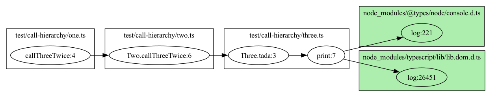

- [ts-call-graph](#ts-call-graph)
- [prerequisite](#prerequisite)
- [example image](#example-image)
- [install](#install)
- [How to generate call graph](#how-to-generate-call-graph)

# ts-call-graph

Automatically generate graphs from source code written in TypeScript/JavaScript using TypeScript language service and its AST.

Sample images are in `example` directory.

## prerequisite

You'll need either [dot command](https://graphviz.org/download/) to generate call graph, which converts `.dot` file to particular files like `.svg`, `.png` and whatnot, or modern web browser which enables to use [hpcc-js-wasm](https://hpcc-systems.github.io/hpcc-js-wasm/).

If you specify `server` parameter `true` or nothing, then you'll use a web browser to generate call graphs in SVG format.
<br>If specified `server` parameter with `false`, then you'll use `dot` command, which is supposed to be installed in advance.
<br>[See the server parameter details shown below.](#how-to-generate-call-graph)

## example image

When executing below command, the following image will be output.

```sh
ts-call-graph test/ -d true -f png
```



And other example output images of well-known libraries are under example folders.

- [nest](./example/nest/README.md)
- [react-dom](./example/react-dom/README.md)
- [ts-node](./example/ts-node/README.md)

## color meaning

- background color

  - standard library which is under `node_modules/@types/node` and `node_modules/typescript/lib`

    **`#adedad`**

  - other packages under `node_modules`

    **`#e6ecfa`**

- stroke

  - When a node doesn't have children, even if it has originally holds. For example, when interactive mode, it might remove its children, for sure can be added again.

    **`#3b82f6`**

## install

[npm](https://www.npmjs.com/package/ts-call-graph)

```sh
npm install ts-call-graph --save-dev
yarn add --dev ts-call-graph
```

## How to generate call graph

- example

```sh
ts-call-graph ./path/to/entry-file.ts -f svg
```

- available options

```sh
Options:
      --version      Show version number                               [boolean]
  -r, --rootDir      root directory where we'll recursively walk through source
                     files. Default directory is current working directory.
                                                              [string] [default:
                                                          "current working directory"]
  -o, --outDir       output directory                         [string] [default:
                                                   "current working directory/output"]
      --tsconfig     path to tsconfig.json which is TypeScript transpile config
                                                                        [string]
  -f, --format       out put format
      [string] [choices: "jpg", "jpeg", "jpe", "jp2", "pdf", "png", "ps", "ps2",
                           "psd", "sgi", "svg", "svgz", "webp"] [default: "svg"]
  -d, --declaration  is include declaration           [boolean] [default: false]
  -v, --verbose      Use verbose output               [boolean] [default: false]
  -l, --line         The line number where call graph starts            [number]
      --server       Whether you use server to render call graphs or dot
                     command.                          [boolean] [default: true]
      --help         Show help                                         [boolean]
```

- ./path/to/entry-file.ts
  First command line arg, as in entry file or directory where we'll walk through to generate call graph.
  If this is a directory, We'll all files in the directory, and if a file, just output the only call graphs about the file.
- rootDir
  When we output graphviz, this directory will be the base directory. Default value is current working directory.
  **`<rootDir>`/path/to/entry-file.ts**

  **example**)
  `rootDir` parameter will remove the output files' directory names.

```sh
~ $ pwd
/Users/xxxx
~ $ ls
test     package.json
~ $ ls test/call-hierarchy
one.ts          three.ts        two.ts
~ $ npm run ts-call-graph ./test/call-hierarchy/
~ $ ls output/test/call-hierarchy/
one.ts#callThreeTwice:4.dot     three.ts#log:8.svg              two.ts#tada:7.dot               two.ts#tada:8.svg
one.ts#callThreeTwice:4.svg     three.ts#print:4.dot            two.ts#tada:7.svg
three.ts#log:8.dot              three.ts#print:4.svg            two.ts#tada:8.do
```
